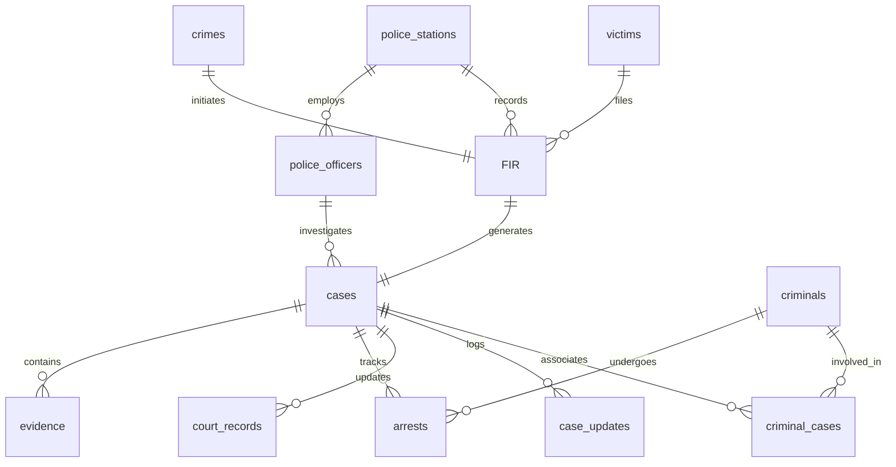

# Crime Record Management System (CRMS)
### Database Management System (DBMS) Mini Project

```
=============================================================================
Project Title: Crime Record Management System (CRMS)
Course: Database Management Systems (DBMS)
Submitted By: Riddhi Garg
Tech Stack: Python Flask, MySQL / SQLite, HTML5, CSS3, JavaScript, Bootstrap
=============================================================================
```

This repository contains the complete **Crime Record Management System (CRMS)** developed as a college DBMS project. The system supports full CRUD operations, role-based access control, parameterized SQL execution, multi-table transactions, and database analytics.

---

## Academic Documentation & Technical Report

### 1. Abstract
The Crime Record Management System (CRMS) is a web-based portal developed to automate and streamline the record-keeping and case management practices of municipal police departments and judicial authorities. Traditionally, police records—ranging from First Information Reports (FIRs) and suspect dossiers to evidence registries and court hearing logs—have been managed using manual ledger systems or disparate flat-file architectures. This results in data redundancy, search inefficiencies, security vulnerabilities, and difficulties in compiling crime statistics. 

CRMS addresses these challenges by implementing a normalized relational database design that enforces referential integrity constraints, primary keys, and foreign keys. The system separates user access levels into administrative managers and field officers (RBAC), provides a global multi-entity search index, and automates timeline logging for crime investigations. By utilizing SQL aggregate functions and database views, CRMS enables station chiefs to compile performance reports, workload metrics, and spatial crime analysis.

---

### 2. Problem Statement
Existing municipal police stations suffer from a lack of integrated databases to track criminal case lifecycles. When a crime is reported, it triggers a cascade of administrative events: registering the victim, filing the FIR, generating an active case, assigning an investigating officer, collecting forensic evidence, executing suspect arrests, and tracking court trial hearings. 

Without an integrated DBMS, correlation between suspect dossiers and active arrest sheets is difficult. Furthermore:
* Files are vulnerable to unauthorized modifications.
* Investigating officers lack real-time access to prior offense history of suspects.
* Evidence items are frequently misplaced or lack documented chains of custody.
* Station chiefs cannot easily analyze local crime trends or track officer case-resolution ratios.

---

### 3. Project Objectives
The objective of this project is to model, build, and deploy a normalized relational database application that automates police administration:
1. **Relational Database Design:** Ensure third normal form (3NF) compliance across all tables to minimize redundancy.
2. **Transaction Integrity:** Implement database transactions (ACID properties) during multi-table inserts, ensuring that if an FIR is filed, the associated victim, crime, and case file are generated simultaneously or rolled back completely in case of failure.
3. **Role-Based Access Control (RBAC):** Provide granular dashboard views and actions depending on user roles (Admin vs. Officer).
4. **Global Querying & Reports:** Support sub-second search filters across criminal names, badge numbers, FIR IDs, and cities, while compiling real-time charts using aggregate SQL queries.

---

### 4. Existing vs. Proposed System

| Parameter | Existing Manual / Flat-File System | Proposed CRMS Relational Portal |
| :--- | :--- | :--- |
| **Data Redundancy** | High; same victim and suspect details are rewritten in separate registers. | Minimal; achieved via 3NF normalization and foreign keys. |
| **Search Speed** | Extremely slow; requires manual retrieval of physical logbooks. | Near-instantaneous using indexed SQL search. |
| **Security** | Vulnerable to theft, loss, and unauthorized modifications. | Secured via password hashing, Flask session RBAC, and input validation. |
| **Data Integrity** | Prone to human errors; conflicting dates or invalid badge numbers. | Enforced using constraints, check conditions, and referential integrity. |
| **Analytical Reporting** | Compiling statistics takes weeks of manual collation. | Instantaneous dashboard charts powered by SQL aggregate queries. |

---

### 5. System Requirements

#### Hardware Requirements
* **Processor:** Intel Core i3 / AMD Ryzen 3 or higher
* **Memory (RAM):** Minimum 4 GB (8 GB recommended)
* **Storage:** 500 MB free disk space for local execution

#### Software Requirements
* **Operating System:** Windows 10/11, macOS, or Linux
* **Language Runtime:** Python 3.8 to 3.12
* **Database Engine:** MySQL Server 8.0+ or MariaDB (Automated SQLite 3 fallback engine provided)
* **Web Browser:** Google Chrome, Mozilla Firefox, Safari, or Microsoft Edge

---

### 6. Relational Database Schema & 3NF Normalization
The database is structured into 14 normalized tables designed to satisfy **Third Normal Form (3NF)**:
1. **1NF Compliance:** All attributes contain atomic, single-valued cells. Multi-valued arrays (such as multiple suspect names on a case) are mapped to a junction table.
2. **2NF Compliance:** The tables satisfy 1NF, and all non-key columns are fully dependent on the primary key, eliminating partial dependencies.
3. **3NF Compliance:** No transitive dependencies exist; non-prime attributes are not dependent on other non-prime attributes. For example, rather than storing the police station address and phone directly on the officer record, we store `station_id` (foreign key) which references `police_stations`.

#### Entity Relationship Diagram (Mermaid)



---

### 7. Database Table Specifications

1. **`users`**: Manages portal credentials. Enforces UNIQUE username constraint.
2. **`police_stations`**: Contains address, city, and state details for precincts.
3. **`police_officers`**: Stores badge numbers (UNIQUE) and maps personnel to stations.
4. **`criminals`**: Main suspect catalog holding physical identification tags and aliases.
5. **`victims`**: Complainant directory with check constraints for age (0 to 120).
6. **`witnesses`**: Contains statements and witness records.
7. **`crimes`**: Incident index log with severity and status attributes.
8. **`FIR`**: Legal report connecting the crime, victim, and receiving station.
9. **`cases`**: Criminal case dossier reference with priorities (High, Medium, Low).
10. **`criminal_cases`**: Junction table for the many-to-many relationship between criminals and cases. Enforces a composite primary key: `PRIMARY KEY (criminal_id, case_id)`.
11. **`evidence`**: Logs chain of custody, storage locations, and collection dates.
12. **`arrests`**: Records suspect arrest logs and lockup details.
13. **`court_records`**: Captures trial verdicts, judges, sentences, and court sessions.
14. **`case_updates`**: Relates investigation timeline text to case folders.

---

### 8. DBMS Analytical Queries & view Definitions
The system leverages specific SQL strategies to perform analytics:
* **Views:** Enforces modularity and query simplicity:
  * `case_summary_view`: Merges cases, crimes, and officers.
  * `officer_workload_view`: Computes case loads per badge number.
* **Aggregate Queries:** Compiled for dashboard metrics:
  ```sql
  -- Total Crimes by Category and Solved Ratio
  SELECT crime_type, COUNT(*) as total_incidents, 
         SUM(CASE WHEN status = 'Solved' THEN 1 ELSE 0 END) as solved_count 
  FROM crimes 
  GROUP BY crime_type;
  ```
* **Many-to-Many Joins:**
  ```sql
  SELECT cr.name, c.case_number, cc.involvement_type 
  FROM criminal_cases cc 
  JOIN criminals cr ON cc.criminal_id = cr.criminal_id 
  JOIN cases c ON cc.case_id = c.case_id;
  ```

---

## Installation & Running Guide

This project features a **dual-engine database architecture**:
* It connects to a **MySQL** server when configured via environment parameters.
* It **automatically falls back to an SQLite database** (`database/crms_local.db`) with identical structures and realistic sample records if a MySQL server is not detected locally. This ensures immediate out-of-the-box execution for demonstration and grading.

### 1. Project Directory Structure
```
crime-record-management-system/
├── app.py
├── config.py
├── requirements.txt
├── README.md
├── .gitignore
├── .env.example
├── .env
├── database/
│   ├── schema.sql
│   ├── sample_data.sql
│   └── queries.sql
├── templates/
│   ├── base.html
│   ├── login.html
│   ├── dashboard.html
│   ├── criminals.html
│   ├── criminal_details.html
│   ├── crimes.html
│   ├── add_crime.html
│   ├── fir.html
│   ├── cases.html
│   ├── case_details.html
│   ├── officers.html
│   ├── stations.html
│   ├── evidence.html
│   ├── arrests.html
│   ├── court_records.html
│   ├── reports.html
│   ├── search.html
│   ├── users.html
│   ├── 403.html
│   ├── 404.html
│   └── 500.html
├── static/
│   ├── css/
│   │   └── style.css
│   └── js/
│       └── script.js
└── utils/
    ├── database.py
    └── auth.py
```

### 2. Quick Setup & Local Launch

#### Step A: Clone or Extract the Project
Open your terminal and navigate to the project directory:
```bash
cd Crime_Management_System
```

#### Step B: Install Python Dependencies
```bash
pip install -r requirements.txt
```

#### Step C: Set up Environment Parameters
Copy `.env.example` to `.env`:
```bash
cp .env.example .env
```
Open `.env` in a text editor. By default, it is configured with:
```env
DB_HOST=localhost
DB_PORT=3306
DB_USER=root
DB_PASSWORD=your_mysql_password
DB_NAME=crime_record_management
SECRET_KEY=crms_secret_key_super_secure_987654321
```
*If you do not have MySQL running, the application will automatically initialize the local SQLite database file `database/crms_local.db`.*

#### Step D: Run the Application
Start the Flask web server:
```bash
python app.py
```
Open your browser and navigate to: **[http://localhost:5001](http://localhost:5001)**

---

### 3. Demo Credentials
Use these pre-configured user credentials to log in:

* **Administrator Access (Full CRUD, User Control, Officers management):**
  * **Username:** `admin`
  * **Password:** `admin123`
* **Police Officer Access (View Assigned cases, add evidence, updates, arrest logs):**
  * **Username:** `officer1`
  * **Password:** `officer123`

---

### 4. Git Instructions
To prepare the system for GitHub uploads, execute the following commands in order:
```bash
git init
git add .
git commit -m "Initial Crime Record Management System Commit"
git branch -M main
# Replace with your actual repository URL:
# git remote add origin https://github.com/YOUR_USERNAME/YOUR_REPO.git
# git push -u origin main
```

---

### 5. Deployment Instructions
The application is structured to run on modern hosting services (Heroku, Render, PythonAnywhere, Docker):
1. **Render/Heroku Setup:** Configure the launch command in your Procfile: `gunicorn app:app`.
2. **Environment Variables:** Define the variables (`DB_HOST`, `DB_PASSWORD`, `SECRET_KEY`) inside the platform dashboard settings to override the `.env` values.
3. **Database Migration:** Import `database/schema.sql` and `database/sample_data.sql` to your production cloud MySQL server.

---

### 6. System Architecture (Frontend -> Flask -> MySQL / SQLite)

```
 [ Browser (HTML5/CSS3/JS) ] 
            │
            ▼ (HTTP GET/POST Requests)
 [ Flask Web Server (app.py) ] <──> [ Auth Controller (utils/auth.py) ]
            │
            ▼ (DictCursor Parameters)
 [ SQL Database Helper (utils/database.py) ]
            │
            ├─► Connects to [ Local/Cloud MySQL Database ] (If online)
            └─► Connects to [ Fallback SQLite3 File (.db) ] (If MySQL offline)
```
1. **Frontend View Layer:** The user inputs form data (such as linking a suspect) on a Bootstrap-rendered interface.
2. **Controller Routing Layer:** Flask reads request variables, validates session cookies, checks user permissions using decorators, and triggers SQL statements with parameterized arguments.
3. **Database Abstraction Layer:** `utils/database.py` executes queries on the active engine, safely preventing SQL injection.
4. **Data Return Layer:** SQL returns matching rows as dictionary maps to Flask, which renders them dynamically to the Jinja templates.
